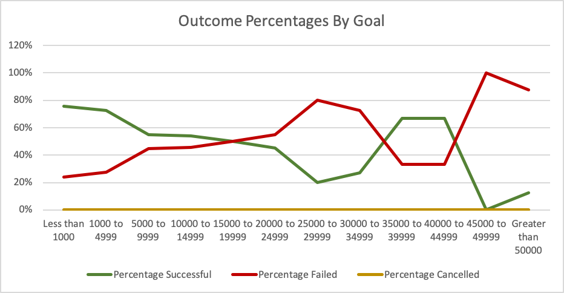
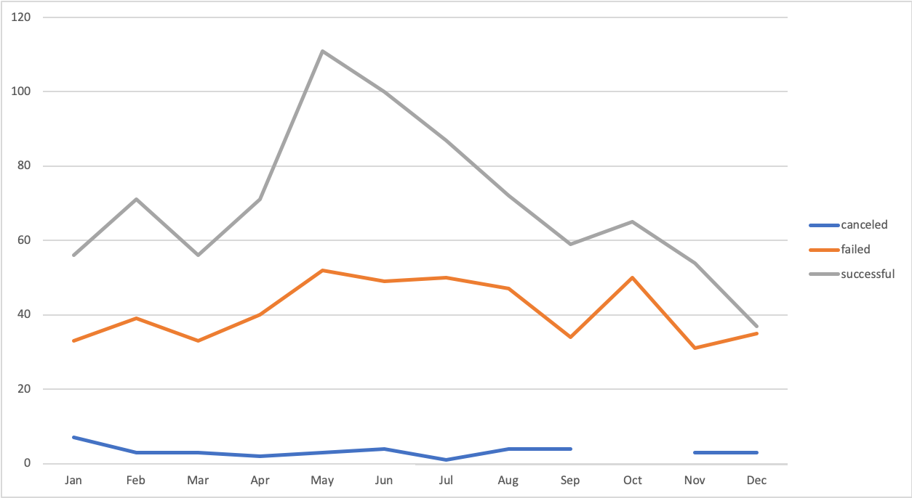

# ModuleChallenge1
Repository for Module 1 Challenge

###Challenge
---
After conducting my analyses, there are a number of conclusions and suggestions that can be made regarding the findings of the analyses. First, I'll start with the conclusions that can be made.
---

* The first conclusion that can be made comes from this chart depicting the % of outcomes from Kickstarter campaigns based on their starting goal. One clear observation is that campaigns that lower campaign goals, such as those less than $1,000 or inbetween $1,000 and $4,999, had a much higher success rate than other campaigns. These campaigns had a success rate between 60 and 80%. The campaigns that had a goal less than $1,000 were successful 76% of the time, which was the highest success rate among all other Kickstarter campaigns for plays.  

* The second conclusion is that campaigns that has an extremely high campaign goal, ($45,000 or more) had an extremely **Low** success rate of under 20%.

Based on these observations, I would recommend to Louise that she set a campaign goal preferably less than $1,000 or no greater than $4,999 if she really wanted to maximize her chances of having a successful campaign. 
---
Admittedly, there were campaigns in the $35,000 to $39,999 and the $40,000 to $44,999 ranges that also had very high success rates. I would like to pose that a possible limitation of the visualization is that we don't know about any of the circumstances regarding why those plays were much more successful than other plays that had very high goals. I would suggest modifying this chart to include the "total number of campaings" for each goal range. The reason why there was a spike in the % of successful goals in the $35,000 and $40,000 range could be because there is a smaller sample size of plays in those goal ranges (6 plays).

---

The chart above visualizes the outcomes of theatre kickstarter campaigns based on when the campaigns were initially launched.
---
*The greatest conclusion that can be gained from this data visualization is that the number of successful campaigns had a huge spike  in the month of May. I hypothesize that this is because potential patrons have more money saved up as the months lead into the summer. As a result, they may be more financially able to support a kickstarter campaign.

Based on this data, I would recommend that Louise pick a launch date that is either at the beginning or during the summer months.
---
*Another important observation to point out is that the success rate for campaigns was at its lowest during the later fall months and all of the winter months. In December, the # of successful campaigns were at their lowest. I would hypothesize that this is because potential patrons already have their money tied up in the Holiday shopping season.

I would recommend that Louise **Avoid** any start date in the months of November - January.
---
This section presents some limitations as well. Although it is nice to know about what launch months help guide a successful campaign, the tables and visualizations don't show describe how any other variables might impact whether or not a campaign is successful. 

I believe it would be helpful if we had taken the difference in time between the End Date and the Start Date to get the total campaign length. It would be helpful for Louise to know how long to make her campaign. I believe she would be interested to know if certain campaigns were more successful if they had a shorter campaign length so that patrons felt more pressure to support the cause rather than put it off. 

Another line chart could describe the success rate for campaigns depending on the total campaign length. When filtered in with campaign goals AND start date, adding the campaign length might allow Louise to maximize the effectiveness of her kickstarter campaign.
